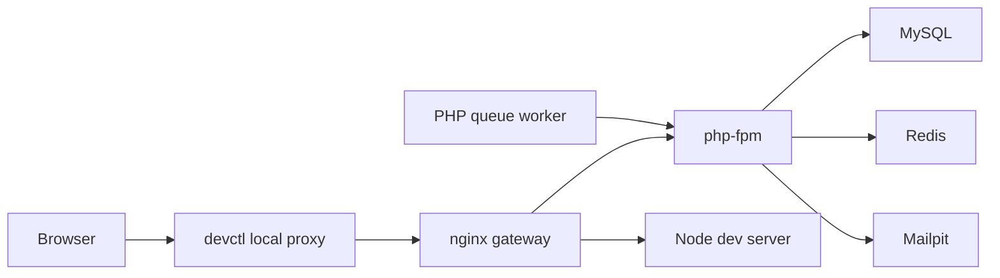

# Architecture

This repository is a multi-preset local development template.

Rule: a real project runs exactly one active preset in `apps/` at a time. All supported presets remain available under `.presets/` and can be switched via `devctl make skeleton.preset use=<name>`.

## Repository Boundaries

```text
apps/       Active preset's application code (flat; always exactly one preset)
.presets/   Source for every supported preset; the active one is materialized into apps/
.docker/    Local runtime infrastructure only
docs/       Architecture notes, runbooks, and decisions
packages/   Shared code with explicit ownership
```

Rules:

- `apps/` owns product code.
- `.presets/` owns preset source; only the active preset is copied into `apps/`.
- `.docker/` owns local runtime only.
- `packages/` is only for code used by more than one app.
- `docs/adr/` stores accepted architecture decisions.

## Runtime Model



`gateway` is the only HTTP entrypoint in Compose.

Routing:

- PHP presets: nginx serves `public` and forwards `.php` to `php:9000`.
- Next preset: nginx proxies to `node:3000`.
- `/health`: returns `204`; for Next it maps to `/api/health`.

## Preset Boundaries

### `APP_PRESET=laravel`

Path: `.presets/laravel` (materialized into `apps/` via `devctl make skeleton.preset use=laravel`)

Minimal PHP front controller with Laravel-compatible public-root shape. It is not a Laravel install.

Contract:

- Public web root: `apps/public`
- Health endpoint: `/health`
- PHP runtime: `php`

### `APP_PRESET=next`

Path: `.presets/next` (materialized into `apps/` via `devctl make skeleton.preset use=next`)

Contract:

- Dev server listens on `0.0.0.0:3000`
- Health endpoint: `/api/health`
- Public access goes through `gateway`, not directly through the Node port

### `APP_PRESET=legacy`

Path: `.presets/legacy` (materialized into `apps/` via `devctl make skeleton.preset use=legacy`)

Contract:

- Public web root: `apps/public`
- PHP source: `apps/src`
- Frontend source: `apps/frontend`
- Build output: `apps/public/theme/dist`

Generated frontend assets are not source of truth unless deployment requires committing them.

## Preset Markers

Shared infrastructure files carry lines that belong to only some presets.
`scripts/preset_markers.py` prunes them: `install-preset.py` renders
`.presets/_infra/Makefile.tmpl` down to `.make/active.mk`, and `init-project.py`
strips the rest on `skeleton.init`. Both read the same grammar.

Block form, for whole regions:

```sh
# >>> preset:laravel,legacy
run-php-thing:
	$(PHP) 'echo hi'
# <<< preset
```

Line form, for a single trailing line:

```make
PHP_RUN := $(COMPOSE_CI) run --rm php sh -lc # preset:laravel,legacy
```

Markdown files use `<!-- >>> preset:next -->` / `<!-- <<< preset -->` and
`<!-- preset:next -->`.

Rules:

- Valid tags: `laravel`, `next`, `legacy`, plus `template`. A `template` region
  is removed by every `skeleton.init`, whichever preset is chosen — use it for
  lines that only make sense in the skeleton repo itself.
- No nesting, and every open marker needs a close. Both are hard errors, not
  warnings.
- Never put a marker inside a heredoc; the pruner works line by line and cannot
  tell the difference.

The markers are load-bearing. Reformatting or "tidying" them away silently
changes what a generated project gets.

## Configuration Contract

Required files:

- `.devctl.json`: project name, Compose adapter, managed port variables, and health check.
- `.env.example`: documented runtime variables.
- `.env`: local uncommitted overrides.
- `.docker/compose.yml`: service graph and container wiring.

Utility runtime:

- `tools`: containerized repository validation utilities.

Managed ports:

- `PORT_HTTP`: nginx gateway.
- `PORT_DB`: MySQL.
- `PORT_REDIS`: Redis.
- `PORT_MAIL`: Mailpit.

Published ports bind to `127.0.0.1`. Public browser access should go through the `devctl` local domain or the loopback port.

## Quality Gates

Local gates:

- `devctl make skeleton.smoke`: validates `.devctl.json`, `.env.example`, legacy preset naming, and Compose config.
- `devctl make lint`: runs frontend ESLint and PHP_CodeSniffer.
- `devctl make fmt-check`: checks frontend Prettier and PHP_CodeSniffer formatting.
- `devctl make types`: runs TypeScript and PHPStan checks.
- `devctl make test`: runs Vitest and PHPUnit suites.
- `devctl make verify`: runs the full local gate.
- `devctl make qa`: runs the full local gate plus security audits.

CI mirrors local gates without production secrets or destructive Docker cleanup.

## Updating an Initialized Project

`devctl make skeleton.update [to=<tag>]` pulls upstream skeleton improvements
into an already-initialized project. It only touches paths listed as
`skeleton_owned` in `skeleton.manifest.json` (infrastructure: `.docker/`,
specific `scripts/*.py` tooling files, `Makefile`, `.presets/_infra/`, CI,
ops docs — see the manifest for the exact list) — `apps/`,
`.presets/{laravel,next,legacy}/`, `packages/`, and project docs are never
read or written by this command.

Mechanics:

- `.versions/current.json` records the skeleton tag/SHA the project was last
  synced from; it is the `base` for a per-file 3-way merge (`git merge-file`).
- Conflicts surface as ordinary `<<<<<<<` / `=======` / `>>>>>>>` markers
  inside the affected file — the same UX as a normal `git merge` conflict.
- Nothing is committed or pushed automatically; review with `git diff` and
  commit once conflicts (if any) are resolved.
- Files the upstream skeleton no longer manages are reported, not deleted.

Preset switching is handled by `devctl make skeleton.preset use=<name>` (materializes
`.presets/<name>` into `apps/`), not by `skeleton.update`. `skeleton.update`
only syncs skeleton-owned infrastructure files — including the shared
`.presets/_infra/Makefile.tmpl` template — and never changes which preset is
currently active.

## Production Boundary

Do not reuse this Compose stack as production deployment.

Production must define separate project names, secrets, reverse proxy, service scaling, image build flow, database policy, backups, and observability.
